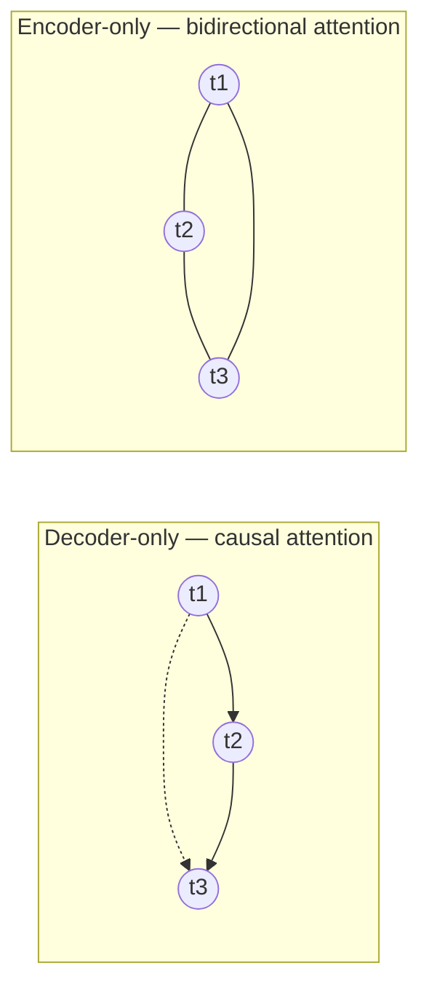
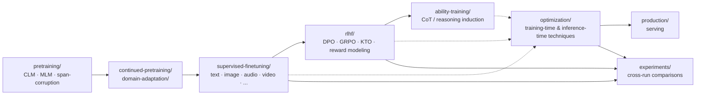

# LLM / mLLM Training & Optimization — A Research Project

A personal research project for learning LLM and multimodal-LLM training,
finetuning, and optimization in depth — well beyond the
[HuggingFace LLM Course](https://huggingface.co/learn/llm-course/en/chapter1/1),
which stops around basic transformer usage, a light SFT pass, and a brief
RLHF intro. This repo goes further in four directions the course doesn't
cover in depth:

1. **The full training lifecycle**, in the order a model is actually built:
   pretraining → continued pretraining / domain adaptation → supervised
   finetuning → RLHF → ability induction (e.g. teaching a model Chain-of-Thought
   reasoning it didn't have) → optimized, production serving.
2. **Every core architecture family** — encoder-only, encoder-decoder, and
   decoder-only — for text *and* multimodal (image, audio, video, tabular,
   graph, time-series), not just decoder-only LLMs.
3. **Training- and inference-time optimization as a first-class subject**,
   not an afterthought: quantization (PTQ vs QAT), LoRA/QLoRA/DoRA,
   FlashAttention, DeepSpeed/FSDP, distillation, pruning, speculative
   decoding, KV-cache/paged attention — each studied in isolation *and*
   used as a flag on real task scripts.
4. **Empirical answers, not just theory**: `experiments/` exists specifically
   to answer questions like *"does a model quantized at inference perform the
   same as one trained with QAT?"* or *"does CoT training actually improve
   accuracy on this task?"* by comparing real runs against each other.

This is explicitly a multi-session, incrementally-built project. See the
[Roadmap](#roadmap) below for what's built vs. planned.

---

## Table of Contents

1. [Theory Primer](#theory-primer)
2. [Repository Structure](#repository-structure)
3. [Roadmap](#roadmap)
4. [Dataset Reference](#dataset-reference)
5. [Environment & Hardware Setup](#environment--hardware-setup)
6. [Model Selection Philosophy](#model-selection-philosophy)
7. [Storage Hygiene](#storage-hygiene)
8. [Model Saving Strategies](#model-saving-strategies)
9. [Shared CLI Flag Conventions](#shared-cli-flag-conventions)
10. [How to Add a New Script](#how-to-add-a-new-script)
11. [Per-Stage README Index](#per-stage-readme-index)
12. [Experiments](#experiments)
13. [Troubleshooting](#troubleshooting)
14. [Archive Note](#archive-note)

---

## Theory Primer

### Attention, in one analogy

A transformer layer's self-attention lets every token look at every other
token (or, for causal models, every *earlier* token) and decide how much to
"pay attention to" each one. Concretely, each token produces three vectors:
a **Query** ("what am I looking for?"), a **Key** ("what do I represent?"),
and a **Value** ("what information do I actually offer, if you attend to
me?"). A token's new representation is a weighted sum of every visible
token's Value, where the weights come from comparing its Query against every
Key (`softmax(QKᵀ / √d)`). It's like a search engine running *inside* the
sentence: every word issues a query, every word advertises a key, and the
words whose keys best match the query contribute most to the result.
**Multi-head** attention just runs several of these searches in parallel
with independently-learned Q/K/V projections, so different heads can
specialize (e.g. one tracking syntactic dependencies, another tracking
coreference).

Two things attention *doesn't* give you for free, which is why every
transformer needs more than just attention layers:
- **Position information.** Attention itself is permutation-invariant — it
  doesn't inherently know token 3 comes after token 2. Position must be
  injected separately: learned absolute position embeddings (used by our
  from-scratch `pretraining/` models for simplicity), sinusoidal encodings,
  or relative schemes like RoPE (Qwen/Llama) or T5's relative-position
  buckets.
- **Per-position computation.** After attention mixes information *across*
  positions, a position-wise feed-forward network (usually a 2-layer MLP
  with a ~4× hidden expansion) processes *each* position independently —
  this is where the majority of a transformer's parameters (and much of its
  "knowledge capacity") actually live.

Residual connections and LayerNorm around both sub-layers are what make deep
stacks of these blocks trainable at all.

### The three architecture families

The one design choice that determines almost everything else about how a
model can be used is **what each token is allowed to attend to**:



| | Decoder-only<br/>(GPT, Llama, Qwen) | Encoder-only<br/>(BERT, DeBERTa) | Encoder-decoder<br/>(T5, BART) |
|---|---|---|---|
| Attention | Causal (only earlier tokens) | Bidirectional (every token) | Encoder: bidirectional. Decoder: causal + cross-attends to encoder output |
| Pretraining objective | Causal LM (predict next token) | Masked LM (predict masked tokens from full context) | Span corruption (reconstruct dropped spans) |
| Natural strength | Open-ended generation | Fixed-input representations (classification, embeddings, retrieval) | "Transform input X into output Y" where X is fully known upfront (translation, summarization) |
| Why this pairing | A causal *objective* needs a causal *mask* — if the model could see future tokens while "predicting" one, it would trivially copy the answer and learn nothing generation-useful | With no autoregressive generation to protect, there's no reason to restrict attention — full bidirectional context gives the richest possible representation | Needs both: bidirectional understanding of a complete input, and causal, coherent generation of an output conditioned on it |

`pretraining/clm.py`, `pretraining/mlm.py`, and `pretraining/span_corruption.py`
each train one of these families from scratch — see that folder's README for
the mechanics in code.

### Pretraining objectives, precisely

- **Causal Language Modelling (CLM)**: loss is the standard next-token
  cross-entropy at every position (given a packed sequence with no padding,
  every position contributes).
- **Masked Language Modelling (MLM)**: ~15% of tokens are corrupted (BERT's
  original recipe: 80% replaced with `[MASK]`, 10% replaced with a random
  token, 10% left unchanged — implemented for us by
  `transformers.DataCollatorForLanguageModeling(mlm=True)`); loss is
  computed *only* over the corrupted positions, using their full
  bidirectional context to predict the original token.
- **Span corruption**: instead of masking individual tokens, *contiguous
  spans* are replaced with a single sentinel token each (`<extra_id_0>`,
  `<extra_id_1>`, ...); the decoder must generate exactly the dropped
  content, each span preceded by its sentinel. This gives denser supervision
  per training example (reconstructing multi-token spans, not single
  tokens) and a much shorter target sequence than full input reconstruction
  would require, which is part of why it trains efficiently.

### SFT, instruction tuning, and chat tuning

**Supervised finetuning (SFT)** adapts a pretrained model to a specific
input→output format using labeled `(prompt, response)` pairs, with loss
typically **masked to the response tokens only** (`labels[i] = -100` for
every prompt/instruction token — HF's cross-entropy loss ignores `-100`
positions) so the model isn't penalized for not "predicting" text it was
only ever meant to *read*, not generate.

**Instruction tuning** is SFT specifically over *diverse task instructions*
("summarize this", "translate this", "classify this") rather than one fixed
task, so the model generalizes to following novel instructions at inference
time, not just the exact tasks it happened to see in training.

**Chat tuning** is SFT specifically over multi-turn conversational data with
role structure (system / user / assistant), and typically builds *on top of*
instruction tuning rather than replacing it.

### RLHF algorithm family

After SFT, RLHF further aligns model behavior using a signal derived from
*preferences* (or, in RLVR variants, *verifiable correctness*) rather than
labeled demonstrations. This project uses `trl` for all of it — `transformers`
has no native RLHF trainer support.

- **Reward modeling**: train a separate model to score a response, typically
  from pairwise human comparisons (chosen vs. rejected).
- **DPO (Direct Preference Optimization)**: reformulates the RLHF objective
  as a direct classification-style loss over `(chosen, rejected)` response
  pairs — no separate reward model, no online RL rollout needed. The
  practical, most common starting point for preference alignment today.
- **GRPO (Group Relative Policy Optimization)**: an RL method (used in
  DeepSeekMath / DeepSeek-R1) that estimates advantage by comparing a
  *group* of sampled responses to the same prompt against each other,
  instead of needing a learned value function like classic PPO — simpler
  and more memory-efficient, which is presumably why `trl==1.9.2` ships
  `GRPOTrainer` but no `PPOTrainer`.
- **KTO (Kahneman-Tversky Optimization)**: aligns using *unpaired* binary
  "good/bad" feedback (inspired by prospect theory) rather than requiring
  explicit chosen-vs-rejected pairs, which can be easier and cheaper to
  collect than preference pairs.

**RLHF's prerequisite**: every algorithm above assumes the policy model
*already* follows the target response format/behavior — running RLHF
directly on a raw pretrained model doesn't work in practice, there's nothing
coherent yet to align. See `rlhf/README.md`
and `experiments/rlhf-pretrained-vs-sft-init/` (done, Wave 4 — real finding:
the pretrained-init run's reward metric alone looks only slightly worse,
but its generations reveal it converged to a degenerate "always guess A"
shortcut rather than learning the task).

### Quantization & PEFT theory

- **Quantization**: representing weights (and/or activations) with fewer
  bits — e.g. 4-bit NF4 instead of 16-bit bf16 — to cut memory footprint and
  sometimes boost throughput, at some risk of accuracy loss.
- **PTQ (Post-Training Quantization)**: quantize an already-trained
  checkpoint *after the fact*, no extra training. Fast and simple, but the
  model never got a chance to adapt to the quantization error — it's a
  one-shot approximation applied to weights that were optimized assuming
  full precision.
- **QAT (Quantization-Aware Training)**: simulate quantization *during*
  training — weights/activations are fake-quantized in the forward pass
  while gradients still flow through at higher precision (the
  "straight-through estimator" trick) — so the model's weights are nudged
  throughout training to be robust to the eventual quantization. Usually
  preserves more accuracy than PTQ at the same bit-width, at the cost of an
  actual training run rather than a quick conversion step. Comparing these
  two head-to-head is `experiments/qat-vs-ptq-inference/`.
- **LoRA (Low-Rank Adaptation)**: freeze the pretrained weight matrix `W`
  and learn a low-rank update `ΔW = B·A` (with `A`, `B` far smaller than
  `W`) added on top — dramatically fewer trainable parameters and optimizer
  states, since almost the entire model stays frozen.
- **QLoRA**: LoRA *plus* 4-bit quantization of the frozen base weights, so
  the (large) frozen `W` lives in memory at 4-bit precision while the (tiny)
  LoRA adapters train at higher precision. This is what makes finetuning
  models larger than what fits in raw fp16 on an 8GB GPU realistic, and is
  this project's default for any pretrained-model finetuning.
- **DoRA (Weight-Decomposed LoRA)**: decomposes `W` into a magnitude and a
  direction component, applies a LoRA-style low-rank update to the direction
  while learning the magnitude separately — reported to track full
  finetuning's update dynamics more closely than plain LoRA at similar
  parameter cost.

### Inducing CoT / reasoning ability

Two broad approaches to giving a model Chain-of-Thought reasoning it doesn't
have off-the-shelf (see `ability-training/CoT/README.md`):
1. **SFT-based distillation**: train on `(question, teacher_reasoning,
   answer)` triples, with loss on *both* the reasoning and the final answer
   — this is exactly what this project's CoT-variant SFT scripts
   (`*_cot.py`) already do, just not yet framed as "ability induction" for a
   model that started with none.
2. **RL with Verifiable Rewards (RLVR)**: sample multiple candidate
   solutions per question, reward only whether the *final answer* is
   verifiably correct (no reasoning supervision needed at all) — the
   DeepSeek-R1-Zero-style approach, built on GRPO.

### Production serving concepts

- **KV-cache**: autoregressive decoder-only generation would otherwise
  recompute every previous token's Key/Value projections at every new
  generation step; caching them instead is essential for practical
  inference speed — but the cache grows with `sequence_length × batch_size`,
  making it a dominant memory cost at serving time.
- **Paged attention** (vLLM's core idea): manages the KV-cache in fixed-size,
  non-contiguous "pages" (borrowing the idea from OS virtual-memory paging)
  instead of one large contiguous allocation per sequence — this sharply
  reduces memory fragmentation and enables much higher effective batch
  sizes.
- **Continuous batching**: instead of waiting for an entire fixed batch of
  requests to finish before starting the next (static batching), new
  requests are admitted into the running batch the moment any sequence
  finishes — keeps GPU utilization high under real, bursty traffic.
- **Speculative decoding**: a small, fast "draft" model proposes several
  tokens ahead; the large "target" model verifies all of them in a single
  forward pass (cheaper than generating them one-by-one) and accepts the
  longest correct prefix. Speeds up generation *without* changing the
  target model's output distribution — verification guarantees an exact
  match to what the target model would have produced alone.

---

## Repository Structure



| Folder | Purpose | Status |
|---|---|---|
| `common/` | Thin shared plumbing (model loading, quantization, LoRA, saving, seeding, logging, run-result logging, run comparison, sample selection) reused across every stage. Task-specific logic (data, prompts, masking, eval) always stays inline in each script. | done |
| `pretraining/` | Train a model from scratch, one script per architecture family. | **done (Wave 1)** |
| `continued-pretraining/` | Continue training an existing checkpoint on more general text with the same objective. | **done (Wave 3)** |
| `domain-adaptation/` | Continued pretraining specialized to a target domain (medical, legal, code, ...). | **done (Wave 3)** |
| `supervised-finetuning/` | Task-specific finetuning across text, image, audio, video, tabular, graph, and time-series. | **done (Waves 2, 5)** — all 8 modalities |
| `rlhf/` | DPO / GRPO / KTO / reward modeling via `trl`. | **done (Waves 4-5)** — all 4 algorithms |
| `ability-training/` | Induce abilities (starting with CoT/reasoning) into models that lack them. | **done (Wave 4)** |
| `optimization/` | Isolated benchmark scripts per optimization technique, organized by category × resource axis. | **done (Waves 4-6)** — full taxonomy, 11 real scripts |
| `production/` | Serving finetuned/vanilla models (e.g. via vLLM). | **done (Wave 4)** |
| `experiments/` | Cross-run research questions — reads multiple `run_result.json` files, produces comparisons. | **6 real, 0 planned** — all experiment questions answered |
| `old/` | Archive of this repo's original 16-script SFT collection and its tooling, pre-restructure. | archived |

---

## Roadmap

| Stage | Task | Modality | Architecture | Status | Script(s) |
|---|---|---|---|---|---|
| Pretraining | CLM | text | decoder-only | **done** | `pretraining/clm.py` |
| Pretraining | MLM | text | encoder-only | **done** | `pretraining/mlm.py` |
| Pretraining | Span corruption | text | encoder-decoder | **done** | `pretraining/span_corruption.py` |
| Continued pretraining | CLM continuation | text | decoder-only | **done** | `continued-pretraining/continued_pretraining.py` |
| Domain adaptation | CLM domain specialization (medical) | text | decoder-only | **done** | `domain-adaptation/domain_adaptation.py` |
| SFT | Classification | text | decoder/encoder/enc-dec | **done** | `supervised-finetuning/text/classification/**` |
| SFT | NER | text | decoder-only | **done** | `supervised-finetuning/text/ner/decoder-only/**` |
| SFT | MCQ | text | decoder-only | **done** | `supervised-finetuning/text/mcq/decoder-only/**` |
| SFT | Instruction tuning | text | decoder-only | **done** | `supervised-finetuning/text/instruction-tuning/decoder-only/**` |
| SFT | Chat tuning | text | decoder-only | **done** | `supervised-finetuning/text/chat-tuning/decoder-only/**` |
| SFT | VQA | image | decoder-only | **done** | `supervised-finetuning/image/vqa_*.py` |
| SFT | Image classification | image | — | **done (Wave 5)** | `supervised-finetuning/image/image_classification.py` |
| SFT | Object detection | image | — | **done (Wave 5)** | `supervised-finetuning/image/object_detection.py` |
| SFT | Semantic segmentation | image | — | **done (Wave 5)** | `supervised-finetuning/image/image_segmentation.py` |
| SFT | Audio classification | audio | — | **done (Wave 5)** | `supervised-finetuning/audio/audio_classification.py` |
| SFT | Video classification | video | — | **done (Wave 5)** | `supervised-finetuning/video/video_classification.py` |
| SFT | Tabular classification | tabular | — | **done (Wave 5)** | `supervised-finetuning/tabular/tabular_classification.py` |
| SFT | Graph classification | graph | — | **done (Wave 5)** | `supervised-finetuning/graph/graph_classification.py` |
| SFT | Time-series classification | time-series | — | **done (Wave 5)** | `supervised-finetuning/time-series/time_series_classification.py` |
| RLHF | DPO | text | decoder-only | **done** | `rlhf/dpo/dpo.py` |
| RLHF | GRPO (RLVR, verifiable reward) | text | decoder-only | **done** | `rlhf/grpo/grpo.py` |
| RLHF | KTO | text | decoder-only | **done (Wave 5)** | `rlhf/kto/kto.py` |
| RLHF | Reward modeling | text | decoder-only | **done (Wave 5)** | `rlhf/reward-modeling/reward_modeling.py` |
| Ability training | CoT / reasoning induction (RLVR, DeepSeek-R1-Zero-style) | text | decoder-only | **done** | `ability-training/CoT/reasoning_induction_grpo.py` |
| Optimization | QAT vs PTQ (weight-only fake-quant benchmark) | text | decoder-only | **done** | `optimization/training/memory/quantization-aware-training/qat.py`, `optimization/inference/memory/post-training-quantization/ptq.py` |
| Optimization | FlashAttention/SDPA vs eager attention | text | decoder-only | **done (Wave 5)** | `optimization/training/execution-time/flash-attention/flash_attention_benchmark.py` |
| Optimization | Mixed precision (fp32 vs fp16 vs bf16) | text | decoder-only | **done (Wave 5)** | `optimization/training/memory/mixed-precision/mixed_precision_benchmark.py` |
| Optimization | Gradient checkpointing | text | decoder-only | **done (Wave 5)** | `optimization/training/memory/gradient-checkpointing/gradient_checkpointing_benchmark.py` |
| Optimization | LoRA / QLoRA vs full fine-tune | text | decoder-only | **done (Wave 5)** | `optimization/training/memory/lora-qlora/lora_qlora_benchmark.py` |
| Optimization | Quantization bit-width (4-bit vs 8-bit training) | text | decoder-only | **done (Wave 6)** | `optimization/training/memory/quantization-4bit-8bit/quantization_bits_benchmark.py` |
| Optimization | DeepSpeed ZeRO Stage 2 (CPU offload) | text | decoder-only | **done (Wave 6)** | `optimization/training/memory/deepspeed-zero-fsdp/deepspeed_zero_benchmark.py` |
| Optimization | Checkpoint compression (fp32/bf16/gzip) | text | decoder-only | **done (Wave 6)** | `optimization/training/storage/checkpoint-compression/checkpoint_compression_benchmark.py` |
| Optimization | Speculative decoding | text | decoder-only | **done (Wave 6)** | `optimization/inference/execution-time/speculative-decoding/speculative_decoding_benchmark.py` |
| Optimization | KV-caching | text | decoder-only | **done (Wave 6)** | `optimization/inference/execution-time/kv-cache-paged-attention/kv_cache_benchmark.py` |
| Optimization | Real quantized checkpoint disk size | text | decoder-only | **done (Wave 6)** | `optimization/inference/storage/quantized-checkpoint-storage/quantized_checkpoint_storage_benchmark.py` |
| Optimization | Knowledge distillation (teacher-student) | image | encoder-only | **done (Wave 6)** | `optimization/distillation/memory/distillation_benchmark.py` |
| Optimization | Structured pruning (MLP width) | text | decoder-only | **done (Wave 6)** | `optimization/other/execution-time/pruning/pruning_benchmark.py` |
| Production | vLLM serving + throughput/accuracy benchmark (base vs native LoRA) | text | decoder-only | **done** | `production/serve_and_benchmark.py` |

---

## Dataset Reference

A master index of every dataset used anywhere in this repo, so a future
request like *"swap the NER dataset for something else"* can be resolved by
editing one named script. This table aggregates each stage's own local
Dataset Reference table (see `pretraining/README.md`,
`continued-pretraining/README.md`, `domain-adaptation/README.md`,
`supervised-finetuning/README.md`,
`rlhf/{dpo,grpo}/README.md`,
`ability-training/CoT/README.md`,
`optimization/{training/memory/quantization-aware-training,inference/memory/post-training-quantization}/README.md`,
and `production/README.md`) — check there for the fuller per-script detail
(split names, role).

| Dataset | Used by | Stage |
|---|---|---|
| `roneneldan/TinyStories` | `pretraining/clm.py`, `pretraining/mlm.py`, `pretraining/span_corruption.py` | pretraining (done) |
| `iohadrubin/wikitext-103-raw-v1` | `continued-pretraining/continued_pretraining.py` | continued-pretraining (done) |
| `araag2/MedMCQA` (config `processed`, `Explanation` field) | `domain-adaptation/domain_adaptation.py` | domain-adaptation (done) |
| `Tohrumi/glue_sst2_10k` | `text_classification_standard.py` (all 3 architectures) | SFT (done) |
| `domofon/fake_news_cot_reasoning` | `text_classification_{no_cot,cot}.py` | SFT (done) |
| `MorryShah/complex_ner` | `ner_standard.py` | SFT (done) |
| `zilliz/natural_questions-context-relevance-with-think` | `ner_{no_cot,cot}.py` | SFT (done) |
| `araag2/MedMCQA` (config `processed`) | `mcq_standard.py` | SFT (done) |
| `HPAI-BSC/medmcqa-cot-llama31` | `mcq_{no_cot,cot}.py` | SFT (done) |
| `ibivibiv/math_instruct` | `instruction_tuning_standard.py` | SFT (done) |
| `domofon/evol-instruct-code-cot-80k` | `instruction_tuning_{no_cot,cot}.py` | SFT (done) |
| `devrev-research/MathChatSync-reasoning` | `chat_tuning_standard.py` | SFT (done) |
| `PJMixers-Dev/oumi-ai_lmsys_chat_1m_clean_R1-1k-think-1k-response-ShareGPT` | `chat_tuning_cot.py` | SFT (done) |
| `opendatalab/ChartVerse-SFT-1.8M` (streamed) | `vqa_{no_cot,cot}.py` | SFT (done) |
| `trl-lib/ultrafeedback_binarized` | `dpo.py`, `reward_modeling.py` | RLHF (done) |
| `trl-lib/kto-mix-14k` | `kto.py` | RLHF (done) |
| `araag2/MedMCQA` (config `processed`) | `grpo.py`, `reasoning_induction_grpo.py`, `serve_and_benchmark.py`, `mcq_standard.py`, `quantize_and_eval.py` | RLHF / ability-training / production / SFT / experiments (all done) |
| `roneneldan/TinyStories` | `qat.py`, `ptq.py`, `mixed_precision_benchmark.py`, `gradient_checkpointing_benchmark.py` | optimization (done) — same dataset/checkpoint as `pretraining/clm.py`, deliberately, so quantization/precision/checkpointing comparisons aren't confounded by a different starting distribution |
| `uoft-cs/cifar10` | `image_classification.py` | SFT (done) |
| `rishitdagli/cppe-5` | `object_detection.py` | SFT (done) |
| `mattmdjaga/human_parsing_dataset` | `image_segmentation.py` | SFT (done) |
| `ashraq/esc50` | `audio_classification.py` | SFT (done) |
| `nateraw/kinetics-mini` | `video_classification.py` | SFT (done) |
| `scikit-learn/adult-census-income` | `tabular_classification.py` | SFT (done) |
| `torch_geometric.datasets.TUDataset("MUTAG")` | `graph_classification.py` | SFT (done) |
| `mineshj1291/ecg-classification` | `time_series_classification.py` | SFT (done) |

Before relying on any dataset above for an actual run, re-verify it still
loads and has the expected schema — every script's `verify_dataset()` (or
equivalent) step does this automatically via a `streaming=True` peek before
committing to a full load.

---

## Environment & Hardware Setup

**Hardware**: developed against a single NVIDIA RTX 5060 Laptop GPU (8GB
VRAM). Every script's defaults target this tier; see
[Model Selection Philosophy](#model-selection-philosophy) for how model
choices stay within it.

**Virtual environment**: `llm/`, a Python 3.14 venv at the repo root
(`python3.14 -m venv llm`), mirroring the pattern of the user's existing
`~/base` env (plain stdlib `venv`, no `--system-site-packages`, no conda).
Python 3.14 was checked against every pinned package in `requirements.txt`
directly on PyPI before choosing it (not assumed): `torch==2.11.0`,
`torchvision==0.26.0`, and `torchaudio==2.11.0` all ship prebuilt `cp314`
wheels; `vllm==0.26.0` ships an `abi3` wheel (Python-version-agnostic);
`transformers==5.14.1` and `bitsandbytes` are pure-Python/`py3-none-*`;
`sentencepiece`/`scikit-learn` ship `cp314` wheels. `deepspeed` and
`flash-attn` only ever ship as source (`.tar.gz`, true for *every* Python
version, 3.12 included), so expect them to compile on install regardless —
not a 3.14-specific cost.

**One real fix found during actual installation** (not caught by the
wheel-availability check above, which only looks at top-level pinned
packages): the originally-confirmed `datasets==2.17.1` pulls in an old `dill`
(`<0.3.9`) whose pickle internals are incompatible with Python 3.14's stdlib
`pickle` module, *and* separately, `trl==1.9.2` itself requires
`datasets>=4.7.0` — so `2.17.1` was never actually installable here
regardless of Python version. Fixed by bumping to `datasets==5.0.1` /
`dill==0.4.1` in `requirements.txt`; the `load_dataset`/`.map`/`.select`/
`.shuffle`/`.take` API this project uses is stable across that range.

```bash
python3.14 -m venv llm
source llm/bin/activate
pip install -r requirements.txt
```

**A second, system-level (not pip-installable) fix found in Wave 4**:
`vllm==0.26.0`'s engine JIT-compiles Triton/inductor CUDA kernels at
startup, which failed with `fatal error: Python.h: No such file or
directory` — this machine had the `python3.14` and `python3.14-venv`
system packages but not `python3.14-dev` (Debian/Ubuntu ships headers as a
separate package). `pip install` inside `llm/` can't fix this; it needs
`sudo apt install python3.14-dev` at the system level (from the same
deadsnakes PPA already providing `python3.14` here). Worth doing before
touching `production/serve_and_benchmark.py` on a fresh machine.

**Auto-activation via `direnv`**: a `.envrc` file at the repo root
(`source llm/bin/activate`) auto-activates `llm/` whenever you `cd` into
this directory, and auto-deactivates on leaving — `direnv` was already
installed and hooked into bash on this machine. After creating/changing
`.envrc`, run `direnv allow` once (a one-time trust step, not an error).

**Why scripts can `import common` from anywhere**: several stage folder
names contain dashes (`supervised-finetuning`, `reinforcement-learning-...`),
which aren't valid Python identifiers, so this project can't rely on
`python -m package.script` execution. Instead, `llm/`'s site-packages
contains a `repo_root.pth` file pointing at the repo root, so `common/` is
importable regardless of which script you run or your current directory —
run any script directly, e.g. `python pretraining/clm.py`, with `llm/`
active. (If you ever recreate `llm/` from scratch, re-add this: `echo
"$(pwd)" > llm/lib/python3.14/site-packages/repo_root.pth`.)

---

## Model Selection Philosophy

Two rules, applied at every stage from Wave 2 onward (`pretraining/` trains
from scratch, so neither rule applies there — see its README):

1. **The base model must fit in 8GB VRAM *unquantized*.** Specifically: its
   fp16/bf16 weights alone (no LoRA, no 4-bit/8-bit quantization) must load
   comfortably for a forward pass. Worked example: a 1.7B-parameter model at
   2 bytes/param is `1.7e9 × 2 bytes ≈ 3.4GB` — comfortably under 8GB with
   room for activations/KV-cache. This is verified against real HF Hub file
   sizes at implementation time for each script's chosen model, not
   assumed. Quantization (`--quantization 4bit`) and LoRA are then
   *optional, stackable* techniques for training efficiency — not
   requirements just to get the model loaded. This is why this project's
   scripts default to e.g. `Qwen/Qwen3-1.7B-Base` rather than the much
   larger `Qwen/Qwen3-4B` (which needs 4-bit quantization just to fit).

2. **Prefer base (non-instruction-tuned) checkpoints**, except where a stage
   has a genuine methodological prerequisite for an instruction-tuned
   starting point. Most SFT tasks (classification, NER, MCQ, instruction
   tuning, chat tuning, VQA) fine-tune the model end-to-end via
   prompt-masked loss, so they work fine starting from a raw base checkpoint
   and default to one. **RLHF is the clear exception**: DPO/GRPO/KTO/reward
   modeling all assume the policy already follows the target response
   format — running them on a raw pretrained model doesn't work. Scripts in
   `rlhf/` must default `--model` to
   expect an SFT'd/instruction-tuned checkpoint (this project's own SFT
   output, or a vendor `-Instruct` checkpoint if we haven't produced our own
   yet) — never a raw base model. `experiments/rlhf-pretrained-vs-sft-init/`
   demonstrates this empirically (done, Wave 4) — see that experiment's
   README for the "always guess A" degenerate-shortcut finding.

---

## Storage Hygiene

As of 2026-08-17 (after Wave 5's checkpoint/dataset downloads across 7 new
modalities), `/home` has ~154GB free (down from ~207GB) and `/` has
~202GB free — still roomy, not a binding constraint, but worth
re-checking again before a future wave that downloads several more
multi-hundred-MB checkpoints. Still-good practice, not survival necessity:
prefer `--save_strategy adapter_only` (once that flag exists from Wave 2
onward) for routine comparison runs where you don't need a merged,
serving-ready checkpoint; set `--save_total_limit` on longer runs; move
stale outputs into `old/`-style archives instead of letting `./output/`
grow unbounded.

---

## Model Saving Strategies

`common/model_saving.py`'s `save_model(...)` (used from Wave 2 onward — see
`pretraining/README.md` for why the pretraining stage always uses `"full"`)
supports:

| Strategy | What it saves | Disk cost | When to use |
|---|---|---|---|
| `full` | Complete model weights, no LoRA involved | full model size | The only mode for from-scratch pretraining (nothing pretrained to adapt), or full-parameter finetuning. |
| `adapter_only` | Just the LoRA adapter weights | small (typically <1% of base model size) | Fast iteration across many comparison runs — cheapest way to keep every experiment's result around. Requires the base model present at inference time (`PeftModel.from_pretrained(base, adapter_dir)`). |
| `merged` | Adapter merged into the base, one standalone directory | full model size | Deployment/serving — loads directly with plain `from_pretrained()`, no PEFT dependency, which is what tools like vLLM want for simplest/fastest serving. |
| `adapter_and_merged` | Both of the above | full + adapter size | When you want cheap iteration *and* a ready-to-serve artifact from the same run, and disk allows. |
| `base_reference` | A small pointer file recording the exact base checkpoint id/revision used | negligible | Pairs with `adapter_only` so the run stays fully reproducible without duplicating multi-GB base weights in every output directory. |

---

## Shared CLI Flag Conventions

Every script in this repo shares these flags (implemented via `common/`, so
behavior is identical everywhere they apply):

- **`--max_samples`** (default `-1`): `-1` means train on the full
  dataset/split; a positive integer truncates to that many samples. `-1` is
  the default specifically so a script run with no extra flags does a real
  full run, not an accidentally-truncated one.
- **`--sample_selection {random,first,last}`** (default `random`): controls
  *which* samples get picked when `--max_samples` truncates. `random`
  shuffles with `--seed` then takes `n`; `first`/`last` take the first/final
  `n` in dataset order. For **streamed** datasets, `last` isn't cheaply
  supported without materializing the full stream — scripts fail with a
  clear error in that case rather than doing the wrong thing silently (see
  `common/data_selection.py`).
- **`--debug_first_batch`**: loads data and builds the model, prints
  formatted examples (and, for `pretraining/`, the model's real parameter
  breakdown), then exits without training.
- **`--seed`**, **`--output_dir`**: standard across every script.

**Divergence from Wave 2 onward**: `pretraining/` scripts have **no**
`--quantization`/`--lora*` flags (nothing pretrained to quantize or adapt —
every parameter trains from a random init) and no `--save_strategy` choice
(always `"full"`). Every SFT/RLHF/optimization script from Wave 2 onward
*does* expose `--quantization {no,4bit,8bit}`, `--lora*`, `--mixed_precision`,
and `--save_strategy` via `common/quantization.py`, `common/peft_setup.py`,
and `common/model_saving.py`, since those stages load a pretrained base.

### `optimization/` design note

Every optimization technique (LoRA/QLoRA, 4-bit/8-bit quantization,
gradient checkpointing, mixed precision, FlashAttention, DeepSpeed/FSDP,
QAT, PTQ, distillation, pruning, speculative decoding, KV-cache/paged
attention) exists in **two places, for two different purposes**:

- As a **`--flag`** on any relevant task script (`pretraining/`,
  `supervised-finetuning/`, ...) — for getting a task done efficiently, and
  for A/B-ing the same task with the technique on vs. off.
- As a **dedicated, isolated benchmark script** under
  `optimization/<category>/<axis>/<technique>/` — for studying the
  technique itself in focused isolation (VRAM/speed/accuracy/disk measured
  directly, not incidentally). These reuse the same `common/` machinery as
  the task scripts, just with a measurement/comparison harness wrapped
  around it.

`optimization/` is categorized `training/` | `inference/` | `distillation/`
| `other/`, each split into `execution-time/` | `memory/` | `storage/` by
which resource the technique primarily optimizes. Several techniques are
genuinely dual-purpose (mixed precision and FlashAttention save both time
*and* memory; PTQ saves both memory *and* disk) — these get **one primary
placement** by headline motivation, with the secondary benefit documented in
that technique's own README rather than duplicated across folders. QAT
(`training/memory/quantization-aware-training/`) and PTQ
(`inference/memory/post-training-quantization/`) are explicitly cross-linked
to each other and to `experiments/qat-vs-ptq-inference/`, since comparing
them is one of this project's original motivating questions.

---

## How to Add a New Script

1. **Placement**: follow the stage-based folder structure above. Text SFT
   tasks nest `<task>/<architecture-family>/<script>.py`; image/audio/video
   SFT tasks are flat `<modality>/<task>.py` (no architecture-family
   subfolder — see `supervised-finetuning/README.md`'s note on this
   deliberate divergence). Pretraining scripts sit flat in `pretraining/`.
2. **Reuse `common/`** for anything that's genuinely identical across
   scripts today: model loading (`model_loading.py`), quantization config
   (`quantization.py`), LoRA setup (`peft_setup.py`), model saving
   (`model_saving.py`), seeding (`seeding.py`), config/example printing
   (`logging_utils.py`), sample selection (`data_selection.py`), and result
   logging (`run_results.py`). If you're about to copy-paste >10 lines of
   *identical* logic from another script, it probably belongs in `common/`
   instead — but keep the bar high: dataset loading, prompt formatting,
   loss masking, and evaluation logic should stay inline and monolithic per
   script, since that's the part meant to be read and understood without
   abstraction hiding it.
3. **Verify the dataset before committing to it**: peek one example via
   `load_dataset(..., streaming=True)`, assert the expected fields exist,
   and fail fast with a clear message if not.
4. **Implement the shared CLI flags** (`--max_samples`,
   `--sample_selection`, `--debug_first_batch`, `--seed`, `--output_dir`,
   plus the stage-appropriate quantization/LoRA/save-strategy flags).
5. **Write `run_result.json`** via `common/run_results.write_run_result(...)`
   at the end of every run — this is what makes the script's output usable
   by a future `experiments/*/compare.py`.
6. **Update the Dataset Reference table** (both this file's master table and
   the relevant stage README's local slice) if you introduce a new dataset.
7. **Update the Roadmap table** status for the row(s) your script covers.

---

## Per-Stage README Index

- [`pretraining/README.md`](pretraining/README.md) — done
- [`continued-pretraining/README.md`](continued-pretraining/README.md) — done
- [`domain-adaptation/README.md`](domain-adaptation/README.md) — done
- [`supervised-finetuning/README.md`](supervised-finetuning/README.md) — done (Waves 2, 5) — all 8 modalities
- [`rlhf/README.md`](rlhf/README.md) — done (Waves 4-5) — DPO, GRPO, KTO, reward modeling
- [`ability-training/README.md`](ability-training/README.md) — done (Wave 4)
- [`optimization/README.md`](optimization/README.md) — done (Waves 4-6) — full taxonomy, 11 real scripts
- [`production/README.md`](production/README.md) — done (Wave 4)
- [`experiments/README.md`](experiments/README.md) — 6 real, 0 planned

---

## Experiments

`experiments/` holds the cross-run research questions that motivate this
whole project. Each subfolder documents one question, a protocol to
reproduce it, and a `compare.py` that reads the relevant runs'
`run_result.json` files via `common/compare_runs.py`. See
[`experiments/README.md`](experiments/README.md) for the full list and
status; **all six are real today**: [`experiments/pretraining-objective-comparison/`](experiments/pretraining-objective-comparison/README.md)
(comparing the three `pretraining/` scripts' training dynamics),
[`experiments/cot-vs-no-cot-classification/`](experiments/cot-vs-no-cot-classification/README.md),
[`experiments/architecture-family-classification/`](experiments/architecture-family-classification/README.md),
[`experiments/qat-vs-ptq-inference/`](experiments/qat-vs-ptq-inference/README.md)
(QAT roughly halves PTQ's quantization-induced degradation, but only once
quantization is aggressive enough to matter — no difference at 8-bit),
[`experiments/rlhf-pretrained-vs-sft-init/`](experiments/rlhf-pretrained-vs-sft-init/README.md)
(a pretrained-init GRPO run's reward score looks only slightly worse, but
its generations reveal it collapsed to a degenerate "always guess A"
shortcut), and [`experiments/quantized-training-vs-quantized-inference/`](experiments/quantized-training-vs-quantized-inference/README.md)
(quantizing a bf16-trained adapter for inference loses real accuracy
vs. the bf16 reference; QLoRA-trained-from-the-start doesn't have this
problem and even beat the reference on this run).

---

## Troubleshooting

**Out of memory (OOM)**
- Reduce `--batch_size`, increase `--gradient_accumulation_steps`.
- From Wave 2 onward: enable `--quantization 4bit`, `--lora`.
- Reduce sequence/block length (`--block_size` for pretraining, `--max_length` for SFT).

**Slow training**
- Check `--mixed_precision bf16` is set (default).
- `deepspeed`/`flash-attn` compiling from source on first install can look
  like a hang — it isn't; it just takes a while (see Environment setup).

**Loss not decreasing / NaN**
- Run with `--debug_first_batch` first and read the printed formatted
  examples — for SFT-style scripts, confirm the loss-masking diff
  (`common/logging_utils.print_formatted_examples`) shows the *response*
  tokens being trained on, not `-100` everywhere or the whole sequence.
- Try a lower learning rate; confirm `bf16` rather than `fp16` if loss goes
  `NaN` (bf16's wider exponent range is more forgiving for from-scratch
  pretraining).

**Dataset loading errors**
- Every script's `verify_dataset()`-style step peeks the dataset first with
  a clear error naming any missing/renamed field — re-check the dataset's
  current schema on the Hub if this trips.
- For gated/rate-limited datasets or models, `huggingface-cli login` and set
  `HF_TOKEN` to raise your rate limit.

---

## Archive Note

This repo previously held 16 flat, standalone SFT scripts and their test
tooling, built and validated in February 2026. They've been archived as-is
to [`old/`](old/) (with the original README at
[`old/README_v1.md`](old/README_v1.md)) as this repo was restructured into
the stage-based layout described above — Wave 2 rewrites them into
`supervised-finetuning/` per the design already finalized in
[`supervised-finetuning/README.md`](supervised-finetuning/README.md), fixing
a couple of bugs found along the way (see that file). `old/QUICK_REFERENCE.md`
was an earlier, never-fully-realized planning document with a different
script/dataset design than what was actually built — kept for history, not
current design.
